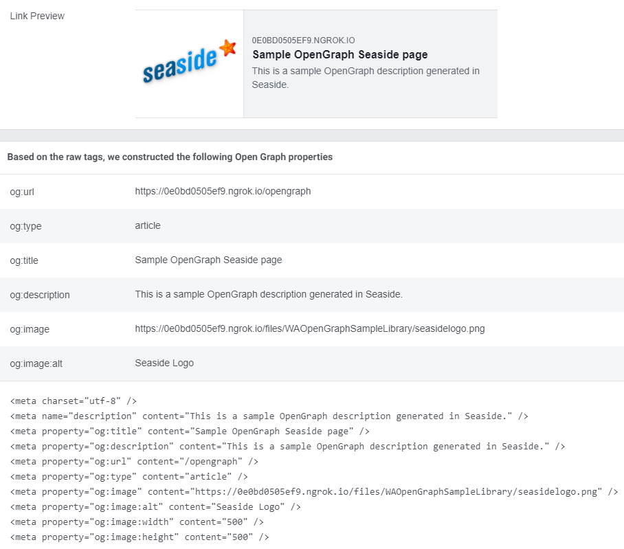

# seaside-opengraph
[OpenGraph](https://ogp.me) metadata generator for [Seaside](https://github.com/SeasideSt/Seaside).

## Brief description

Provides a descriptor object where you can define properties that will be rendered into the `<head>` of a Seaside component.

```smalltalk
	| descriptor |
	descriptor := WAOpenGraphDescriptor new
		              title: 'Sample OpenGraph Seaside page';
		              description: 'This is a sample OpenGraph description generated in Seaside.';
		              url: self requestContext request url;
		              type: 'article';
		              yourself.
	descriptor addElement: (WAOpenGraphImage new
			 url: imageUrl;
			 alt: 'Seaside Logo';
			 width: 500;
			 height: 500).
	^ descriptor
 ```

## Installation
Execute this (requires Seaside already installed).
```smalltalk
Metacello new 
  baseline: 'SeasideOpenGraph'; 
  repository: 'github://eMaringolo/seaside-opengraph/src'; 
  load.
```

## Example

When loading the package `Seaside-OpenGraph-Examples` it will provide a `WAOpenGraphPageOneComponent` registered at `/opengraph` that you can access using your browser and inspecting the `<head>` to see the meta data.

If you access your local Seaside server using something like [`ngrok`](https://ngrok.io) or you have a publicly accessible server, you can test it using [Facebook's sharing debugger](https://developers.facebook.com/tools/debug/).

It should produce an output like this:

